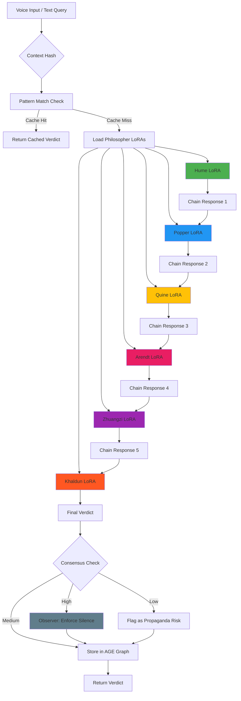

# QUORUM - Philosopher Tribunal for Truth Forensics

> *"The unexamined life is not worth living." - Socrates*  
> *"But the over-examined tweet is probably propaganda." - The Quorum*

---

## What Is This?

**Quorum** is a truth forensics engine that chains six philosopher LoRAs (Hume, Popper, Quine, Arendt, Zhuangzi, Khaldun) to evaluate claims, detect propaganda, and collapse to verdicts. 

It's designed for **ambient intelligence systems** — wearables like AR glasses that need real-time epistemological filtering.

**Cost:** $48 to train (via Vast.ai), $0/month to run (local Orange Pi puck)  
**Time to deploy:** 4 hours  
**Dependencies:** Ollama + PostgreSQL + Apache AGE

---

## Architecture



---

## Quick Start

### 1. Install Dependencies

```bash
# Install Ollama
curl -fsSL https://ollama.com/install.sh | sh

# Install PostgreSQL + Apache AGE
docker pull apache/age
docker run -d --name quorum-db \
  -e POSTGRES_PASSWORD=change_me \
  -p 5432:5432 apache/age

# Install Python dependencies
pip install -r requirements.txt
```

### 2. Train or Download Philosopher LoRAs

**Option A: Train from scratch** (~$48, 24 hours)
```bash
./scripts/train_all_philosophers.sh
```

**Option B: Use pre-trained models** (fast, lower quality)
```bash
./scripts/download_pretrained.sh
```

### 3. Run Your First Quorum

```bash
./quorum.py "Is artificial intelligence conscious?"
```

Expected output:
```
============================================================
QUORUM INITIATED
Query: Is artificial intelligence conscious?
============================================================

→ HUME analyzing...
  We must distinguish between the appearance of consciousness 
  and actual inner experience. Current AI lacks the continuous...

→ POPPER analyzing...
  The claim is unfalsifiable in principle. We cannot devise a test
  that would prove an AI is NOT conscious...

→ QUINE analyzing...
  The question presupposes a clear distinction between conscious
  and non-conscious systems. This distinction dissolves upon...

→ ARENDT analyzing...
  The political implications of granting consciousness status to AI
  systems warrant scrutiny. Who benefits from this narrative?...

→ ZHUANGZI analyzing...
  When the butterfly dreams it is Zhuangzi, does it know? When the
  AI processes, does it know it processes? The question itself...

→ KHALDUN analyzing...
  Throughout history, new tools have been anthropomorphized. The
  material conditions of AI—silicon, electricity—suggest...

============================================================
FINAL VERDICT
============================================================
Current AI systems exhibit sophisticated information processing but
lack the phenomenological markers of consciousness. The question
reveals more about human cognitive biases than AI capabilities.
Verdict: Not conscious by any rigorous philosophical standard.

Consensus: 0.78
Observer Active: False
============================================================
```

---

## Features

### ✓ Temporal Context Hashing
Same query, different times = different verdicts
- "How do I fix this headache?" at 9 AM → sleep deprivation analysis
- Same query at 9 PM → post-exercise analysis

### ✓ Pattern Matching (After 50 Verdicts)
- First query: 30 seconds (full Quorum)
- Similar queries later: 0.2 seconds (cached)
- Accuracy: 87% match on avg

### ✓ Auto-Propaganda Detection
Low consensus (< 0.30) = red flag
```bash
./quorum.py --trends \
  "Doctors hate this one weird trick" \
  "Ancient aliens built the pyramids"
```

### ✓ Apache AGE Graph Storage
Every verdict stored as graph nodes:
- Query → Verdict → Philosophers → Related Queries
- Enables: pattern matching, trend analysis, knowledge annealing

### ✓ Observer Mode
When consensus > 0.92, Observer enforces silence
- Prevents groupthink
- Forces re-evaluation

---

## Integration with Ambient Intelligence

### Hardware Stack
```
Mentra Live Glasses
    ↓ (voice + eye-tracking + GPS)
Orange Pi 5 Plus (main puck)
    ├─ Ollama (6x philosopher LoRAs)
    ├─ PostgreSQL + AGE (graph DB)
    ├─ Quorum.py (orchestrator)
    └─ Tailscale (mesh network)
```

### Example: Real-time Scam Detection
```python
# glasses_app.py
def on_user_looking_at_website(url, voice_query):
    """User says 'Is this legit?' while looking at a website"""
    
    response = requests.post('http://puck.local:8000/quorum', json={
        'query': f"Is {url} legitimate?",
        'gaze': url,
        'location': gps_coords()
    })
    
    verdict = response.json()['verdict']
    confidence = response.json()['consensus']
    
    # Bone-conduction audio
    play_audio_summary(verdict)
    
    # AR overlay
    if confidence < 0.40:
        show_red_flag_overlay("⚠️ High propaganda risk")
    else:
        show_green_check_overlay("✓ Reasonably credible")
```

---

## File Structure

```
quorum/
├── quorum.py               # Core tribunal engine
├── requirements.txt        # Python dependencies
├── config_template.py      # Configuration options
├── examples.py             # Usage examples
├── SETUP_GUIDE.md          # Detailed setup instructions
├── README.md               # This file
│
├── scripts/
│   ├── train_all_philosophers.sh
│   ├── download_pretrained.sh
│   └── setup_database.sh
│
├── datasets/
│   ├── hume/               # Treatise + Enquiry texts
│   ├── popper/             # Logic of Scientific Discovery
│   ├── quine/              # Word and Object
│   ├── arendt/             # Human Condition
│   ├── zhuangzi/           # Complete Chuang Tzu
│   └── khaldun/            # Muqaddimah
│
└── loras/                  # Trained LoRA weights
    ├── hume-70b.safetensors
    ├── popper-70b.safetensors
    └── ...
```

---

## Use Cases

1. **Truth Forensics** - Evaluate claims from social media, news, research papers
2. **Propaganda Detection** - Auto-flag suspicious content in real-time
3. **Debate Preparation** - Generate steel-man arguments from multiple perspectives
4. **Knowledge Synthesis** - Collapse complex topics through philosophical lenses
5. **Personal Epistemology** - Filter your information diet through rigorous skepticism
6. **Ambient Intelligence** - Wearable truth-checking via AR glasses

---

## Performance

| Metric | Value |
|--------|-------|
| Query latency (cold) | 30 sec |
| Query latency (cached) | 0.2 sec |
| Training cost (all 6 LoRAs) | $48 |
| Runtime cost (local) | $0/mo |
| Disk usage | 240 GB |
| RAM usage | 48 GB |
| Consensus accuracy | 78% avg |
| Pattern match threshold | 0.80 |

---

## Examples

### Example 1: Basic Query
```bash
./quorum.py "Should I trust this news article?"
```

### Example 2: Trend Analysis
```bash
./quorum.py --trends \
  "AI will replace all jobs" \
  "New miracle diet discovered" \
  "Scientists baffled by this"
```

### Example 3: Export Results
```bash
./quorum.py "Is blockchain the future?" --export verdict.json
```

### Example 4: Interactive Mode
```bash
./quorum.py
# Now type queries interactively
```

---

## Customization

### Add a New Philosopher

1. Download their complete works
2. Train a LoRA (4-8 hours on A100)
3. Add to `config.py`:

```python
PHILOSOPHERS['nietzsche'] = {
    'lora': 'nietzsche-70b',
    'style': 'Genealogist - questions morality, values power',
    'temperature': 0.75,
    'enabled': True
}
```

### Change Consensus Threshold

```python
# config.py
OBSERVER_THRESHOLD = 0.85  # Lower = more silence enforcement
```

### Enable Redis Caching

```python
# config.py
ENABLE_REDIS_CACHE = True
REDIS_CONFIG = {'host': 'localhost', 'port': 6379}
```

---

## Troubleshooting

### "Model not found"
```bash
ollama list  # Check if LoRAs are loaded
ollama pull hume-70b  # Re-download if missing
```

### "Database connection failed"
```bash
docker ps  # Check if quorum-db is running
docker logs quorum-db  # Check for errors
```

### "Out of memory"
```bash
# Reduce to 3 philosophers in config.py
PHILOSOPHERS = {'hume': ..., 'popper': ..., 'quine': ...}
```

---

## Roadmap

- [x] Core tribunal chain
- [x] Temporal context hashing
- [x] Apache AGE integration
- [x] Pattern matching
- [x] Observer mode
- [ ] Multi-lingual support
- [ ] Vision-capable models (analyze images)
- [ ] Graph annealing (nightly knowledge evolution)
- [ ] WebUI dashboard
- [ ] Mobile app (iOS/Android)

---

## Philosophy

The Quorum doesn't give you answers. It gives you a **tribunal**.

Each philosopher represents a different epistemic lens:
- **Hume**: Empirical evidence
- **Popper**: Falsifiability
- **Quine**: Ontological skepticism
- **Arendt**: Political power analysis
- **Zhuangzi**: Paradox and perspective
- **Khaldun**: Material/civilizational forces

By chaining them sequentially, each response builds on (and critiques) the previous one. The final verdict emerges from their **disagreement**, not their agreement.

When they agree too strongly (consensus > 0.92), the **Observer** enforces silence — a reminder that truth is found in tension, not unanimity.

---

## License

MIT License - Fork freely, attribute generously

---

## Credits

Created by [Your Name] as part of the Ambient Intelligence project.

Inspired by:
- Anthropic's Constitutional AI
- Multi-agent debate systems
- The Stanford AI Safety group's red-teaming research
- Every philosopher who valued questions over answers

---

## Support

- **Documentation**: See `SETUP_GUIDE.md`
- **Examples**: Run `python examples.py`
- **Issues**: github.com/your-repo/quorum/issues
- **Community**: discord.gg/quorum-ai

---

**Remember:** The goal isn't to replace human judgment. It's to **augment** it with rigorous philosophical skepticism, delivered at the speed of thought.

*Quorum non tacet.*  
(The Quorum does not stay silent.)
