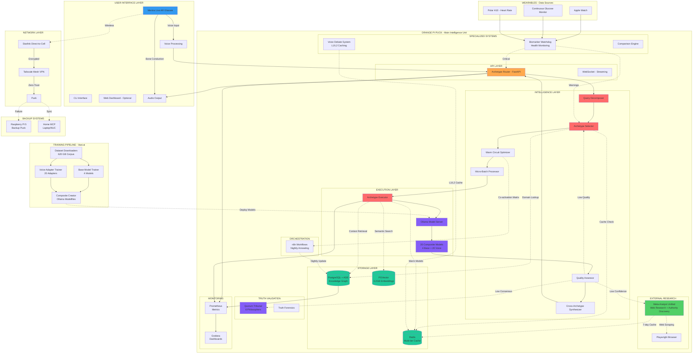
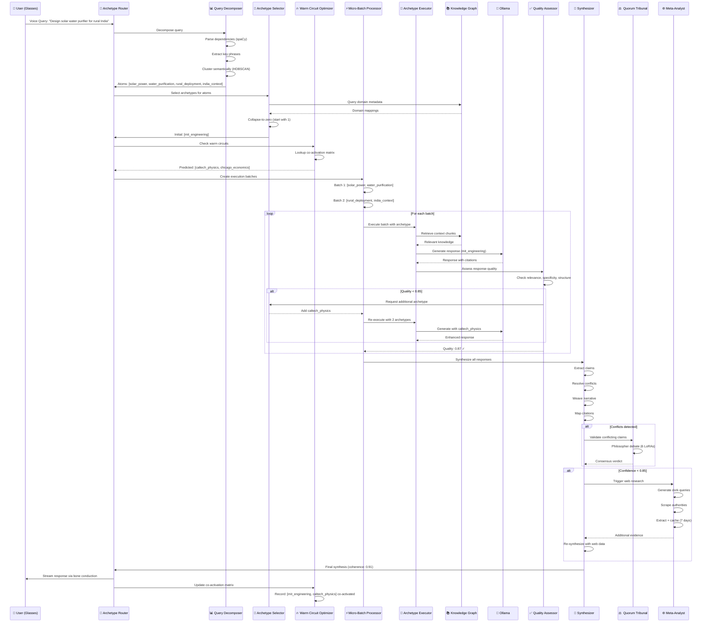
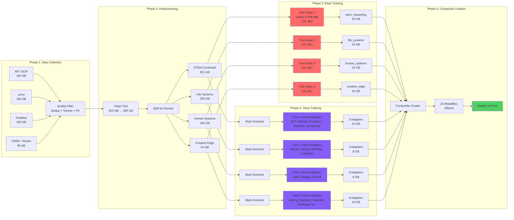
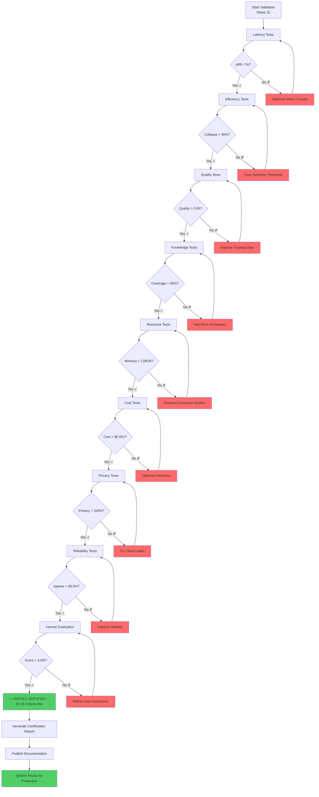
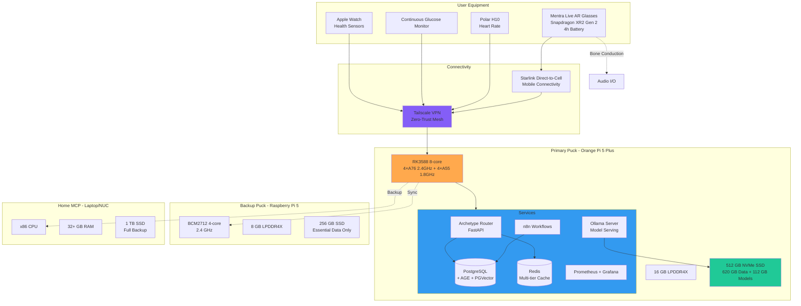
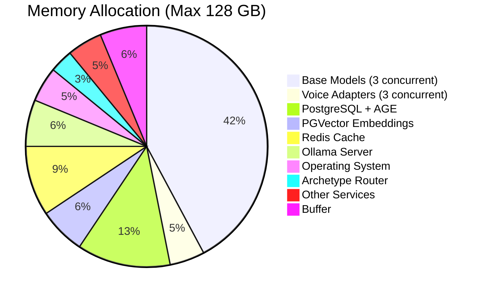
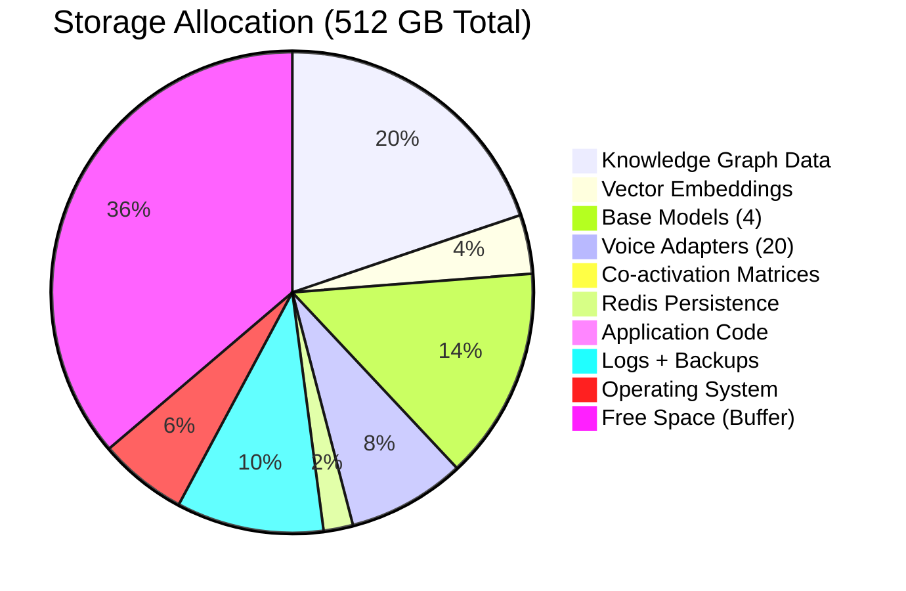

# SYSTEM ARCHITECTURE DIAGRAM - Vertex-Complete Vision

## High-Level System Architecture

---

## Data Flow: Query Lifecycle

---

## Training Pipeline Flow

---

## Vertex Criteria Validation Flow

---

## Deployment Topology

---

## Memory Architecture (128 GB Budget)

---

## Storage Architecture (512 GB NVMe)

---

**END OF SYSTEM ARCHITECTURE DIAGRAMS**

**Purpose:** Visual reference for system design, data flow, and deployment topology  
**Use:** Reference during development, onboarding, and debugging  
**Update:** After each major phase completion

---

*"A picture is worth a thousand lines of code, but a well-designed architecture is worth a million."*

— Graph Ontology | Ambient Intelligence Architecture
