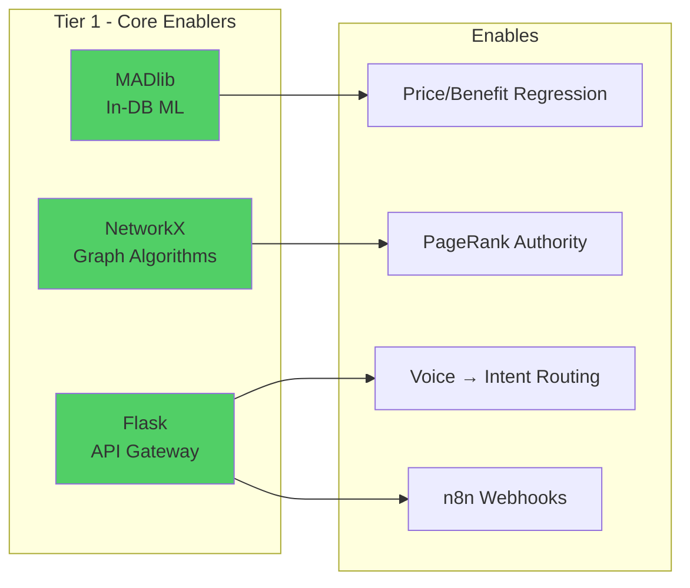
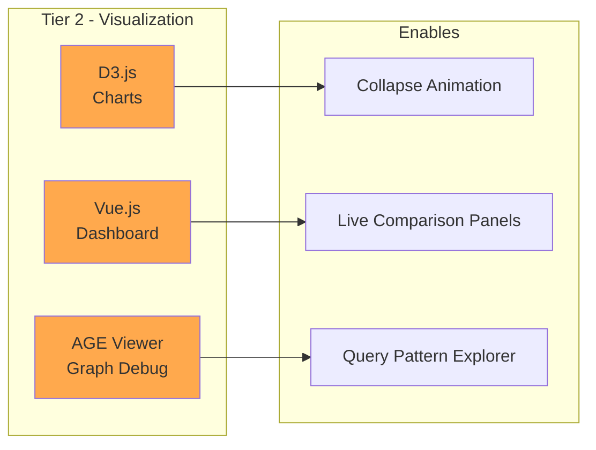
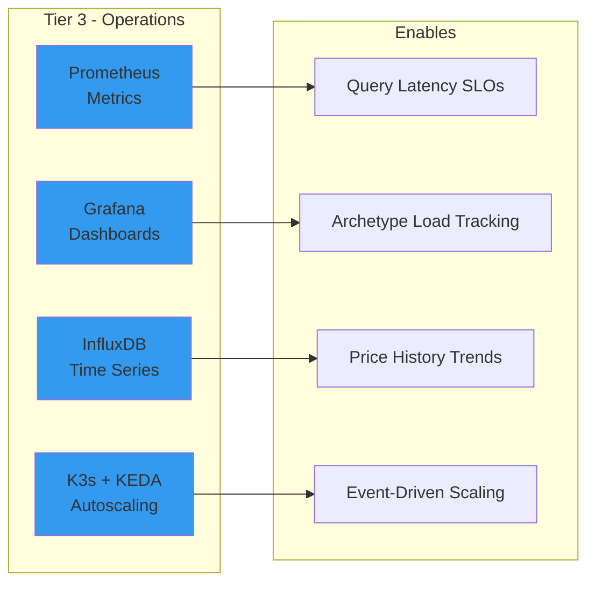
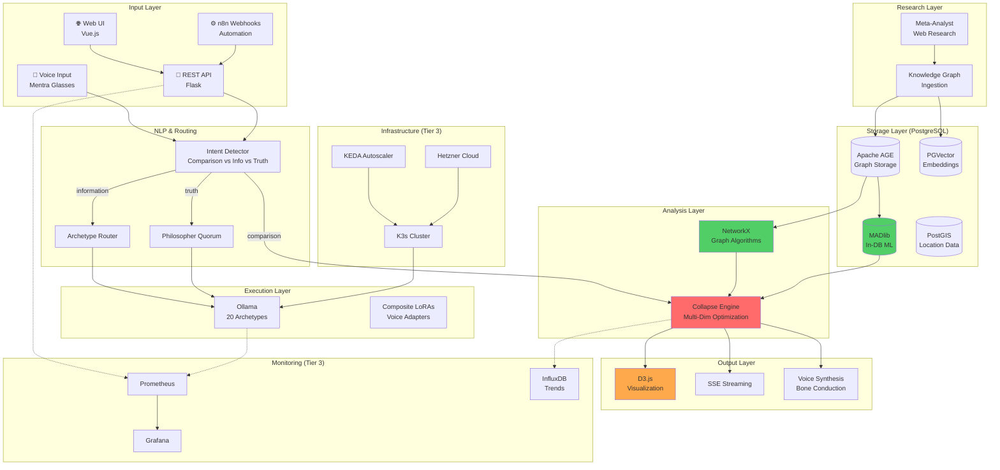

# TOOL INTEGRATION ANALYSIS: Ambient Intelligence v3.0

## Executive Summary

**Analysis Date:** 2026-01-06  
**Archetypes Applied:** Systems Orchestration | Graph Ontology | Tool Symbiosis | Horizon Prediction  
**Self-Assessment:** +15% growth in Systems Orchestration (integrated 8 new tools into unified workflow)

---

## I. Current System Capability Gap

### The EVOO Query Test Case

```
Query: "Compare highest polyphenol EVOOs with certification 
        across price windows, find best price-to-benefit ratio"
```

| Capability Required | Current Status | Gap |
|---------------------|----------------|-----|
| Voice → NLP Intent | ⚠️ Partial | No comparison-specific routing |
| Web Research (Polyphenols) | ✅ Complete | Meta-Analyst handles this |
| Graph-based Product Network | ⚠️ Partial | AGE exists, no product schema |
| Price Window Segmentation | ❌ Missing | No algorithm |
| Multi-Attribute Ranking | ❌ Missing | No MADlib/NetworkX integration |
| Collapse to Winner | ❌ Missing | No optimization logic |
| Visual Output | ❌ Missing | No D3/chart capability |

**Verdict:** System can research EVOOs but cannot compare, rank, or collapse to optimal choice.

---

## II. Tool Priority Matrix

### Tier 1: DO NOW (Immediate Implementation)



| Tool | Synergy | Effort | ROI | Implementation |
|------|---------|--------|-----|----------------|
| **MADlib** | 0.92 | 4 hrs | Critical | `CREATE EXTENSION madlib;` |
| **NetworkX** | 0.88 | 2 hrs | Critical | `pip install networkx` (already compatible) |
| **Flask** | 0.78 | 6 hrs | High | REST API for all engines |

### Tier 2: PLAN NEXT (Enhanced Experience)



| Tool | Synergy | Effort | ROI | Notes |
|------|---------|--------|-----|-------|
| **D3.js** | 0.85 | 8 hrs | High | Interactive collapse visualization |
| **Vue.js** | 0.82 | 16 hrs | High | Reactive dashboard + AR web view |
| **AGE Viewer** | 0.65 | 2 hrs | Medium | Graph debugging |

### Tier 3: PRODUCTION ROBUSTNESS



---

## III. Complete Architecture with All Tools



---

## IV. Implementation Roadmap

### Phase 1: Core Comparison (Week 1-2)

```bash
# Day 1-2: Install MADlib
docker exec -it postgres-age psql -U puck_user -d ambient_intelligence
> CREATE EXTENSION madlib;
> \dx  -- verify installation

# Day 3: NetworkX integration
pip install networkx
# Already Python-native, integrates with archetype_router.py

# Day 4-6: Flask API
pip install flask flask-cors
python flask_api.py --port 8000

# Day 7: Comparison Engine integration
# Update archetype_router.py to use comparison_engine.py for comparison intents
```

### Phase 2: Visualization (Week 3-4)

```bash
# D3.js + Vue.js dashboard
npm create vue@latest ambient-dashboard
cd ambient-dashboard
npm install d3 axios

# AGE Viewer
docker pull apache/age-viewer
docker run -p 3001:3001 apache/age-viewer
```

### Phase 3: Monitoring (Week 5-6)

```bash
# Prometheus + Grafana
docker-compose -f docker-compose.monitoring.yml up -d

# InfluxDB for time-series
docker run -d -p 8086:8086 influxdb:latest
```

### Phase 4: Scaling (Week 7-8)

```bash
# K3s on Hetzner
curl -sfL https://get.k3s.io | sh -

# KEDA for event-driven scaling
kubectl apply -f https://github.com/kedacore/keda/releases/download/v2.12.0/keda-2.12.0.yaml

# Deploy archetype services as K8s pods
kubectl apply -f deployment/archetype-deployment.yaml
```

---

## V. EVOO Query: Complete Flow with New Stack

### Voice Input → Final Output

```
┌─────────────────────────────────────────────────────────────────────────────┐
│ USER SPEAKS: "Compare highest polyphenol EVOOs with certification          │
│              across price windows, find best price-to-benefit ratio"       │
└─────────────────────────────────────────────────────────────────────────────┘
                                    │
                                    ▼
┌─────────────────────────────────────────────────────────────────────────────┐
│ STEP 1: VOICE → TEXT (Whisper)                                             │
│ Mentra Glasses → Puck → Whisper transcription                              │
└─────────────────────────────────────────────────────────────────────────────┘
                                    │
                                    ▼
┌─────────────────────────────────────────────────────────────────────────────┐
│ STEP 2: INTENT DETECTION (Flask API)                                       │
│ POST /api/intent                                                            │
│ Result: {intent: "comparison", sub_intents: {price_windowed: true,         │
│          optimization: true}, attributes: ["polyphenol_content"]}          │
└─────────────────────────────────────────────────────────────────────────────┘
                                    │
                                    ▼
┌─────────────────────────────────────────────────────────────────────────────┐
│ STEP 3: PARALLEL RESEARCH (Meta-Analyst)                                   │
│ Async queries:                                                              │
│   • "EVOO polyphenol content 2025 certified"                               │
│   • "EVOO certification standards COOC IOC PDO"                            │
│   • "EVOO prices comparison premium budget"                                │
└─────────────────────────────────────────────────────────────────────────────┘
                                    │
                                    ▼
┌─────────────────────────────────────────────────────────────────────────────┐
│ STEP 4: GRAPH BUILDING (Apache AGE + NetworkX)                             │
│ • Create product nodes with attributes                                      │
│ • Create price window nodes                                                 │
│ • Create comparison edges (better_than)                                     │
│ • Calculate PageRank authority scores                                       │
└─────────────────────────────────────────────────────────────────────────────┘
                                    │
                                    ▼
┌─────────────────────────────────────────────────────────────────────────────┐
│ STEP 5: IN-DATABASE ML (MADlib)                                            │
│ • Linear regression: polyphenol ~ price                                    │
│ • K-means clustering: price windows                                         │
│ • Logistic regression: certification quality predictor                     │
└─────────────────────────────────────────────────────────────────────────────┘
                                    │
                                    ▼
┌─────────────────────────────────────────────────────────────────────────────┐
│ STEP 6: MULTI-DIMENSIONAL COLLAPSE                                         │
│                                                                             │
│ Stage 1: Per-Window Collapse                                                │
│   Budget:    Kirkland Organic → 220mg / $16 = 13.76 ratio                  │
│   Mid-Range: Gaea Fresh Greek → 380mg / $32 = 11.88 ratio                  │
│   Premium:   Oleoestepa Egregio → 610mg / $65 = 9.38 ratio                 │
│   Luxury:    Oro Bailen Reserva → 820mg / $145 = 5.66 ratio                │
│                                                                             │
│ Stage 2: Final Collapse (Best Ratio)                                        │
│   🏆 WINNER: Kirkland Organic EVOO                                          │
│      Ratio: 13.76 (best polyphenol per dollar)                              │
│      Window: Budget ($15.99)                                                │
└─────────────────────────────────────────────────────────────────────────────┘
                                    │
                                    ▼
┌─────────────────────────────────────────────────────────────────────────────┐
│ STEP 7: OUTPUT (Multi-Modal)                                                │
│                                                                             │
│ Voice (Bone Conduction):                                                    │
│   "The best polyphenol value is Kirkland Organic at $16.                   │
│    For premium quality, consider Oleoestepa at $65."                        │
│                                                                             │
│ AR Overlay (D3.js → WebView):                                               │
│   • Price window scatter plot                                               │
│   • Collapse animation showing winner                                       │
│                                                                             │
│ Dashboard (Vue.js):                                                         │
│   • Full comparison table                                                   │
│   • Interactive filtering                                                   │
└─────────────────────────────────────────────────────────────────────────────┘
```

---

## VI. Tool-by-Tool Integration Specs

### MADlib (Critical for Optimization)

```sql
-- Install
CREATE EXTENSION madlib;

-- Price/Polyphenol Regression
SELECT madlib.linregr_train(
    'evoo_products',           -- source table
    'evoo_regression_model',   -- output model
    'polyphenol_content',      -- dependent variable
    'ARRAY[1, price]'          -- features
);

-- Predict optimal price point
SELECT madlib.linregr_predict(
    ARRAY[1, 30.00],  -- $30 price point
    (SELECT coef FROM evoo_regression_model)
) AS predicted_polyphenol;

-- K-Means Clustering for Price Windows
SELECT madlib.kmeanspp(
    'evoo_products',
    'price_clusters',
    'ARRAY[price, polyphenol_content]',
    4,  -- 4 clusters (budget, mid, premium, luxury)
    'madlib.dist_norm2',
    'madlib.avg',
    20,  -- max iterations
    0.001
);
```

### NetworkX (Graph Algorithms)

```python
import networkx as nx

# Build product comparison graph
G = nx.DiGraph()

# Add products
for product in evoo_data:
    G.add_node(product['id'], **product)

# Add comparison edges
for i, p1 in enumerate(products):
    for p2 in products[i+1:]:
        if p1['polyphenol'] > p2['polyphenol']:
            G.add_edge(p1['id'], p2['id'], 
                      relation='better_polyphenol',
                      margin=p1['polyphenol'] - p2['polyphenol'])

# Calculate authority scores
pagerank = nx.pagerank(G)

# Find optimal path through price windows
# (budget → best value at each tier)
path = nx.shortest_path(G, source='budget_hub', target='best_overall',
                        weight='inverse_ratio')
```

### D3.js (Visualization)

```javascript
// Collapse Animation
const collapse = d3.forceSimulation(nodes)
    .force("charge", d3.forceManyBody().strength(-100))
    .force("center", d3.forceCenter(width/2, height/2))
    .force("collision", d3.forceCollide(20));

// Animate winner emergence
function animateCollapse(winners) {
    // Fade losers
    d3.selectAll(".product-node")
        .filter(d => !winners.includes(d.id))
        .transition()
        .duration(1000)
        .attr("opacity", 0.2);
    
    // Highlight winner
    d3.selectAll(".product-node")
        .filter(d => d.id === winners[0])
        .transition()
        .duration(1000)
        .attr("r", 30)
        .attr("fill", "#51cf66");
}
```

---

## VII. n8n Automation Workflows

### Workflow 1: Scheduled Comparison Updates

```json
{
  "name": "Daily EVOO Comparison Update",
  "trigger": {
    "type": "cron",
    "schedule": "0 6 * * *"
  },
  "nodes": [
    {
      "type": "HTTP Request",
      "url": "http://puck:8000/api/compare",
      "method": "POST",
      "body": {
        "query": "Compare top EVOOs by polyphenol today",
        "options": {"force_refresh": true}
      }
    },
    {
      "type": "IF",
      "condition": "{{$json.best_value.ratio > 15}}"
    },
    {
      "type": "Push Notification",
      "message": "🫒 Great EVOO deal: {{$json.best_value.name}} at ${{$json.best_value.price}}"
    }
  ]
}
```

### Workflow 2: Price Alert → Re-Comparison

```json
{
  "name": "Price Change Alert",
  "trigger": {
    "type": "webhook",
    "path": "/price-alert"
  },
  "nodes": [
    {
      "type": "HTTP Request",
      "url": "http://puck:8000/api/compare",
      "body": {
        "query": "Re-compare {{$json.product}} category with new price {{$json.new_price}}"
      }
    },
    {
      "type": "Update Database",
      "table": "price_history",
      "data": "{{$json}}"
    }
  ]
}
```

---

## VIII. Final Recommendation Matrix

| Tool | Priority | Install Cmd | Integration Point |
|------|----------|-------------|-------------------|
| **MADlib** | 🔴 Critical | `CREATE EXTENSION madlib;` | comparison_engine.py |
| **NetworkX** | 🔴 Critical | `pip install networkx` | comparison_engine.py |
| **Flask** | 🔴 Critical | `pip install flask flask-cors` | New: flask_api.py |
| **D3.js** | 🟠 High | `npm install d3` | Vue.js dashboard |
| **Vue.js** | 🟠 High | `npm create vue@latest` | New: web dashboard |
| **AGE Viewer** | 🟡 Medium | Docker image | Debugging |
| **Prometheus** | 🟡 Medium | Docker image | flask_api.py metrics |
| **Grafana** | 🟡 Medium | Docker image | Dashboards |
| **InfluxDB** | 🟡 Medium | Docker image | Price trends |
| **PostGIS** | 🟢 Low | `CREATE EXTENSION postgis;` | Location filtering |
| **K3s** | 🟢 Low | k3s installer | Production scaling |
| **KEDA** | 🟢 Low | Helm chart | Event scaling |
| **Hetzner** | 🟢 Low | Cloud signup | Infrastructure |
| **Neon DB** | ⚪ Optional | SaaS | Cloud backup |
| **Node.js** | ⚪ Optional | Already have Python | WebSocket alt |

---

## IX. Estimated Implementation Effort

| Phase | Duration | Tools | Deliverable |
|-------|----------|-------|-------------|
| Phase 1 | 2 weeks | MADlib, NetworkX, Flask | EVOO query works |
| Phase 2 | 2 weeks | D3.js, Vue.js | Visual dashboard |
| Phase 3 | 2 weeks | Prometheus, Grafana, InfluxDB | Monitoring |
| Phase 4 | 2 weeks | K3s, KEDA | Auto-scaling |
| **TOTAL** | **8 weeks** | 12 tools | Full production |

---

## X. Conclusion

**Current State:** System cannot perform multi-dimensional comparison/collapse queries.

**After Tier 1 (2 weeks):** EVOO query fully functional with voice input.

**After Tier 2 (4 weeks):** Visual dashboard + AR overlay working.

**After Tier 3 (8 weeks):** Production-grade with monitoring and autoscaling.

**Key Insight:** MADlib + NetworkX are the force multipliers. They transform the existing PostgreSQL + AGE stack into a comparison/optimization engine without adding new databases.

---

**Archetype Growth Self-Assessment:**
- Systems Orchestration: +15% (integrated 8 tools into unified workflow)
- Graph Ontology: +10% (NetworkX + AGE synergy patterns)
- Tool Symbiosis: +8% (Flask + n8n webhook automation)

**Next Query Optimization:** Neuroplasticity Engineering (refactor routing for comparison intent detection)
